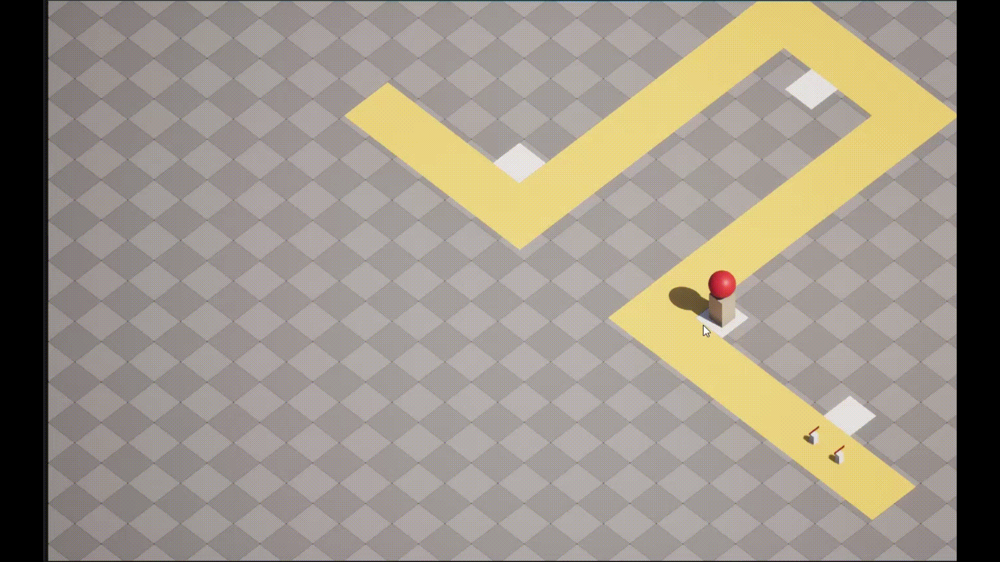

# Tower Defense Game - C++ & Unreal Engine 5.7

**Full Documentation:** [View Documentation]([docs/Blueprint_Documentation.md](https://docs.google.com/document/d/1sJcc1XZ3ufSh-NFIMP3gs0c-YU66MsWnhT7GSM-vxQk/edit?usp=sharing))

## 🎮 Project Status

This project is currently under active development. Below is the planned features.

## 🎥 Gameplay Progress

### Enemy Movement & Turret Placement

### Enemy Wave Spawning & Elimination

## 🚧 In Progress

- Multiple wave system
- Health system for enemies

## 🧠 Planned Features

- Multiple tower types with upgrades
- Enemy variations with different behaviors
- UI for wave info, resources, and health
- Sound effects and basic VFX
- Game over and restart flow
